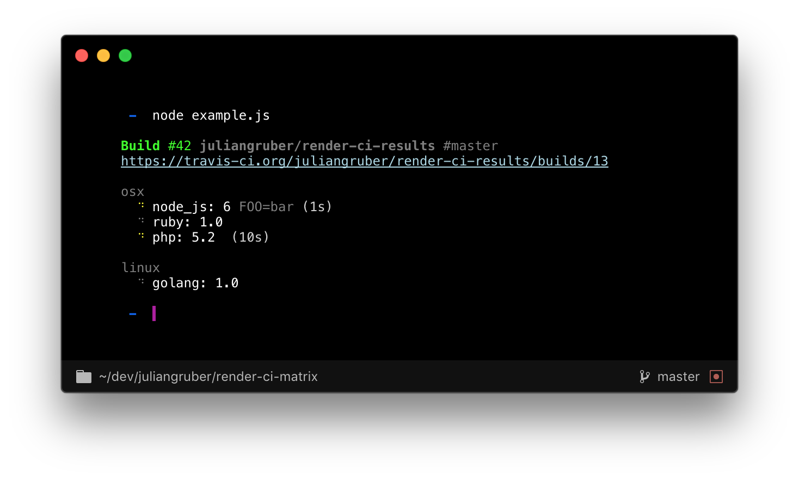

# render-ci-matrix

Render a CI results matrix to the terminal.



## Usage

Use this code to create the output above:

```js
const render = require('render-ci-matrix')()

process.stdout.write(
  render({
    repo: ['juliangruber', 'render-ci-results'],
    build: {
      id: 13,
      number: 42,
      startedAt: Date.now() - 1500
    },
    commit: {
      found: true,
      branch: 'master'
    },
    success: true,
    link: 'https://travis-ci.org/juliangruber/render-ci-results/builds/13',
    results: {
      osx: {
        foo: {
          name: 'node 6',
          env: 'FOO=bar',
          startedAt: Date.now() - 1000,
          state: 'started'
        },
        bar: {
          name: 'ruby 1.0',
          state: 'queued'
        },
        beep: {
          name: 'php 5.2',
          startedAt: Date.now() - 10000,
          state: 'started'
        }
      },
      linux: {
        boop: {
          name: 'golang 1.0',
          state: 'queued'
        }
      }
    }
  })
)

```

## Installation

```bash
$ npm install render-ci-matrix
```

## Related

- __[travis-watch](https://github.com/juliangruber/travis-watch)__ &mdash; Stream live travis test results of the current commit to your terminal!
- __[appveyor-watch](https://github.com/juliangruber/appveyor-watch)__ &mdash; Stream live AppVeyor test results of the current commit to your terminal!
- __[cli-spinners](https://github.com/sindresorhus/cli-spinners)__ &mdash; Spinners for use in the terminal

## License

MIT
